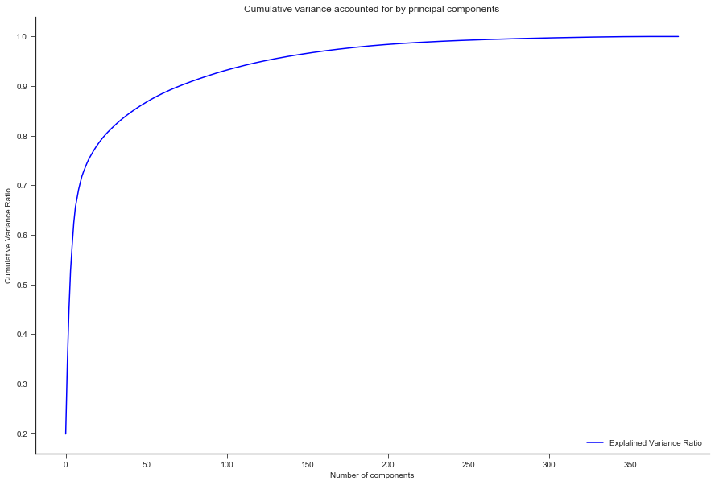

#  Identifying Customer Segments for Arvato

## 0. Introduction
This project involved applying unsupervised learning techniques to identify segments of the population that form the core customer base for a mail-order sales company in Germany. These segments can then be used to direct marketing campaigns towards audiences that will have the highest expected rate of returns. The data used was provided by Udacity partners at Bertelsmann Arvato Analytics.

Four data files were associated with this project:

* `Udacity_AZDIAS_052018.csv`: Demographics data for the general population of Germany; 891 211 persons (rows) x 366 features (columns).
* `Udacity_CUSTOMERS_052018.csv`: Demographics data for customers of a mail-order company; 191 652 persons (rows) x 369 features (columns).
* `Udacity_MAILOUT_052018_TRAIN.csv`: Demographics data for individuals who were targets of a marketing campaign; 42 982 persons (rows) x 367 (columns).
* `Udacity_MAILOUT_052018_TEST.csv`: Demographics data for individuals who were targets of a marketing campaign; 42 833 persons (rows) x 366 (columns).

Each row of the demographics files represents a single person, but also includes information outside of individuals, including information about their household, building, and neighborhood. 

Upon completing the unsupervised learning portion of the project, I was expected to build a supervised learning model on the latter two files, to identify which people were likely to become customers of the company. The metric used for evaulating the model was the [ROC AUC score](https://en.wikipedia.org/wiki/Receiver_operating_characteristic). This is because classification was done by probability - instead of simply picking one of both classes, the model computed the probability of belonging to a particular class. The ROC does a good job of averaging out these probabilities at different thresholds, and so the Area Under this curve provides a good indication of the skill of the model.

This post is an account of the steps I took in cleaning the data, and building the different models.

## 1. Cleaning the Data
Before beginning the process of cleaning and manipulating the data, a quick inspection of the dataset was necessary, to get a feel for the features present. The main dataset contained 891211 rows and 366 columns. Most of these features were ordinal. There were a few categorical and mixed features, and a much smaller number of numerical features. There were a few features with a high proportion of missing values.

The first part of the process of cleaning the data was compiling a useful data dictionary. There were some attributes in the data set which were not described in the data dictionaries provided. Also, there were a number of attributes in the data dictionary which were not found in the dataset.

For those attributes of the first kind, I looked for similar attributes in the existing data dictionary, and assumed that they were similar. For example, all the attributes beginning with `D19` were assumed to be ordinal, at a household level, and with `0` to indicate missing or unknown values. 

Even after all this was done, there were some attributes whose nature was truly unknown, because they resembled none of the attributes in the existing data dictionary. All but two of them seemed to be ordinal, and so I made the assumption that they were. The other two were  `EINGEFUEGT_AM` which was a date, and `EINGEZOGENAM_HH_JAHR`, which was numeric. I then treated them accordingly and added to the data dictionary. 

At this point, I had a comprehensive data dictionary, and was ready to begin cleaning and transforming the data. 

The first step was to transform all the missing data into `NaN`, so that pandas could identify them as missing values and treat them as such.

Secondly, I had to eliminate all the columns which had a high proportion of missing values. I chose to eliminate the columns with more than 30% of their values missing. Below is a graph showing the columns with the highest proportions of missing data points in the dataset:

The next step was to eliminate the rows with missing data points. Most of the rows were relatively clean, and only a few had more than 25 missing values. As such, I divided the dataset in two: one whose rows all had fewer than 25 missing values, and another whose rows had more than 25 missing values. I then proceeded to investigate the distribution of some attributes between both datasets. I found that there wasn't much of  a qualitative difference between both datasets as shown in the figure below, and so I decided to keep the dataset with fewer than 25 missing values.

At this stage I had to re-encode and transform variables according to their types. I will briefly describe this process below:

* `OST_WEST_KZ` is a binary variable, but wasn't numeric, and so I re-encoded it.

* `CACAMEO_DEUG_2015` and `CAMEO_DEU_2015` both describe the wealth and life stage typology, albeit at different scales. I will keep `CAMEO_DEUG_2015`, that which describes the typology at the rough scale, and discard `CAMEO_DEU_2015`, which does the same at fine scale. The same is true of `LP_FAMILIE_FEIN` and `LP_FAMILIE_GROB` and `LP_STATUS_FEIN` and `LP_STATUS_GROB`, where the variable ending in `FEIN` is a fine-scale variable, and that ending in `GROB` is a rough-scale variable.

* I also dropped `GEBAEUDETYP`, which is a building-level feature, which simply describes the types of buildings.

There were a handful of features that are marked as "mixed" in the feature summary that required special treatment in order to be included in the analysis. 

* `PRAEGENDE_JUGENDJAHRE` combines information on three dimensions: generation by decade, movement (mainstream vs. avantgarde), and nation (east vs. west). I create two new variables to capture the other two dimensions: an interval-type variable for decade, and a binary variable for movement.
* `CAMEO_INTL_2015` combines information on two axes: wealth and life stage. I break up the two-digit codes by their 'tens'-place and 'ones'-place digits into two new ordinal variables (which, for the purposes of this project, is equivalent to just treating them as their raw numeric values).

* I created two new columns: `PJ_DECADE` to capture the decade dimension, and `PJ_movement` to capture the movement. For `PJ_decade`, I created six new categories, one for each decade represented in the data. For `PJ_movement`, I created a binary variable. 1 represents the Mainstream movement, while 2 represents the Avantgarde movement. I kept the `PLZ8_BAUMAX` feature, because I found it easy, and reasonable to separate the building types in the region into family and business type buildings. So I grouped all the family homes into one category, irrespective of the size, and left the business buildings in a category of its own.

* I dropped the `LP_LEBENSPHASE_FEIN` and `LP_LEBENSPHASE_GROB` features, because they were too cumbersome to separate appropriately, and the `WOHNLAGE` feature because I didn't find any reasonable way to aggregate the subdivisions between features.

Once this was done, I replaced all missing values with the mode for categorical variables, and the median of each column for ordinal variables. I chose this over filling in all missing values with 0 because 0 sometimes indicates a missing or unknown value. I then performed one-hot encoding on the categorical variables in the dataset.

* The variable `EINGEFUEGT` was in datetime format, and so I converted it into a numeric format, keeping only the year.

* I found the numerical features that were too skewed, performed a log transformation on them, and then use a MinMax Scaler to re-scale them

 I also dropped the `LNR`  column, because `LNR` is basically some form of an index.

## 2. Unsupervised learning
At this stage of the analysis I performed dimensionality reduction on the dataset using Principal Component Analysis (PCA). I found that 89 principal components explained 92% of the variance in the dataset, which is interesting, given that this is less than one quarter of the dataset. This is probably because many of the features in the dataset are highly correlated.

The plot of cumulative variance against number of components is show below.

Now I divided the dataset into clusters. To do so, I first made a scree plot, of Sum of Square Errors against number of clusters, in order to determine the optimal number of clusters for the dataset. I used MiniBatch KMeans Clustering, becuase it is much faster than standard KMeans, with only a slight drop in quality of results [(see here)](https://chrisalbon.com/machine_learning/clustering/minibatch_k-means_clustering/).

From the figure above, I chose to partition the dataset into 15 clusters, given that the decline in error was almost negligible beyond K=15 clusters.

Now I had to compare the clusters formed by the general dataset, and those formed by the customer dataset. If we assumed that both datasets are similar, then the proportions of customers in each cluster would be the same. However, if they are different, then some segments of the population are more likely to become customers of the company than others. Below is a bar chart showing the proportion of people in each dataset belonging to the various clusters:

From this we can see that people from clusters 3 and 6 are highly overrepresented in the customer population. To gain a better understanding of the difference between the two populations, I compared two clusters - cluster 2 and cluster 3.

There are more than 300 features in the dataset. As such it would be virtually impossible to compare both clusters exhaustively. However, I selected four features and compared both populations, just for illustrative purposes. The four features I selected are:

* `SEMIO-PFLICHT`: How dutiful the person is, with high values indicating low affinity for duty
* `FINANZ-MINIMALIST`: How low their financial interest is, with high values indicating low affinity
* `PJ-Movement`: Predominant movement of a person's youth
* `SEMIO-SOZ`: How socially minded the person is, with high values indicating low affinity

From the charts above, we can see that the target population is less dutiful, has a lower financial interest, and has a higher social affinity than the general population. The dominating movement of their youth is is Avantgarde, compared to the Mainstream movement for the general population.

## 3. Supervised learning
At this stage I had to build a supervised learning model to predict whether a given individual would become a customer of the company or not. The customer dataset contained a `RESPONSE` column, which indicated whether or not the person was a customer. One interesting thing about this dataset was that there was a huge class imbalance - only about 1.2% of the entries belonged to customers.

I began by cleaning the data using the steps outlined in Section 1 above. I then performed dimensionality reduction and clustering on the dataset, and created a new variable in the dataframe to store the cluster that each person belonged to. Because some clusters have a high proportion of customers, I think this new variable will help the algorithms better calculate the probability that a given person belonged to a particular class. I treated this variable as a categorical variable, and, natually, performed one-hot encoding on it. 

When it came to building the model itself, I opted for a stacked model. Stacking is a machine learning method that aims to improve predictive accuracy by combining predictions from multiple models. For the best results, it is advised to use different kinds of models as base models - tree based models, boosting models, regression models, etc. This is because each category of models trains differently, and can compensate for the weaknesses of the other.

In this case, I chose the following as base models:

* Random Forest Classifier
* Gradient Boosting Classifier
* Logistic Regression
* Multilayer Perceptron Classifier
* LightGBM

I then used a Gradient Boosting Classifier as a meta-learner. The goal was to optimize the ROC-AUC-score of the model, given that accuracy is not a good metric for evaluating models on highly imbalanced datasets.

To begin with, I performed hyperparameter tuning on the base models using the `hyperopt` library, which is based upon a Bayesian framework. I then fed the tuned models, as well as the meta learner, using the `mlens` library developed by Sebastian Flannerhag [here](www.ml-ensemble.org).

The following are the ROC AUC scores of the base learners, after some hyperparameter tuning:

| Model                  | ROC AUC score |
|------------------------|---------------|
| Gaussian Naive Bayes   | 0.7484        |
| Random Forest          | 0.7484        |
| Gradient Boosting      | 0.7924        |
| LightGBM Classifier    | 0.8054        |
| Multi-Layer Perceptron | 0.7055        |
| Logistic Regression    | 0.7133        |

The stacked model had a score of 0.8138, whic is a major improvement over all the base learners.

I now trained the model on the entire dataset, and saved, for use in the kaggle competition.

## Conclusion
This was a really interesting machine learning project, especially given the difficulty of dealing with highly imbalanced data. While researching techniques on dealing with such issues, I came across a few techniques, most notably Synthetic Minority Over-sampling Technique ([SMOTE](https://jair.org/index.php/jair/article/view/10302)), and another technique called EC3 for combining clustering and classification ([here](https://arxiv.org/abs/1708.08591) )

My implementation of SMOTE did not yield a good ROC-AUC score, probably because there are subtleties to the use of this technique which I haven't mastered yet, and so I decided not to use it. I also didn't use EC3 because I couldn't find any python libraries implementing it, and there wasn't enough time to code it up myself.

However, both of these techniques look really interesting to me, and will be useful additions to my toolkit in the near future.

I originally tried adding the clusters from the unsupervised learning part of the project into the dataset - my intuition being that because some clusters contain a higher proportion of customers than others, this would be a useful feature while training the model. However, I lacked the computing capacity to do so. I kept getting an `OSError: Too many open files` when I did this. Probably in the near future when I have more computing power, or figure out how to bypass this issue, I will investigate this option and see how the results differ.

There are also many things that could be done differently during the cleaning and engineering phase of the project - use of different scalers, imputing missing values differently, etc., which I would definitely try, to see what effects they have on the final score.

